# Diabetes Clinical Classification — MLOps Pipeline

> **End-to-end ML pipeline** for Pima Indians Diabetes classification, refactored from a monolithic Jupyter notebook into a production-grade, reproducible MLOps workflow with DVC pipeline automation and MLflow experiment tracking.

---

## Dataset

**Pima Indians Diabetes Database** — 768 samples, 8 features, binary target (Outcome):

| Feature | Description |
|---------|-------------|
| Pregnancies | Number of pregnancies |
| Glucose | Plasma glucose concentration |
| BloodPressure | Diastolic blood pressure (mm Hg) |
| SkinThickness | Triceps skin fold thickness (mm) |
| Insulin | 2-Hour serum insulin (mu U/ml) |
| BMI | Body mass index (kg/m²) |
| DiabetesPedigreeFunction | Diabetes pedigree function |
| Age | Age (years) |
| Outcome | 0 = Non-diabetic, 1 = Diabetic |

---

## Exploratory Data Analysis

Full EDA available in [`notebooks/eda.ipynb`](notebooks/eda.ipynb).

### Key Findings

| Insight | Detail |
|---------|--------|
| **Class Imbalance** | ~65% non-diabetic, ~35% diabetic — SMOTE applied for balancing |
| **Top Correlated Features** | Glucose > BMI > Age > Pregnancies > DiabetesPedigreeFunction > Insulin |
| **Age & Diabetes** | ~94.5% of diabetic patients are in the 20–50 age group |
| **Zero Values** | Glucose, BloodPressure, BMI have biologically implausible zeros → treated as NaN |
| **Outliers** | Insulin and DiabetesPedigreeFunction have the most outliers |

### EDA Plots

<p align="center">
  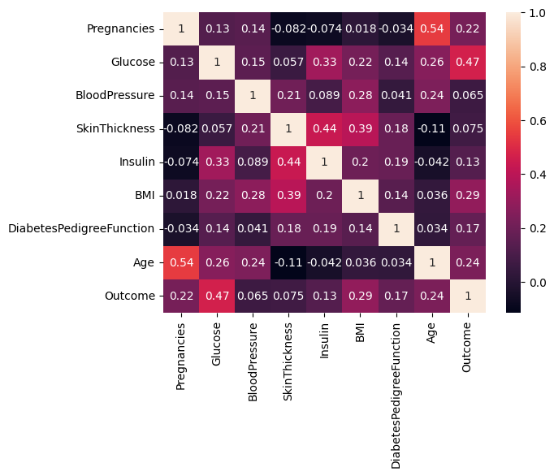
  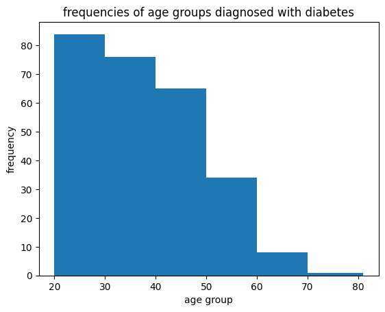
  <br><em>Feature correlation (left) & Age distribution of diabetic patients (right)</em>
</p>

<p align="center">
  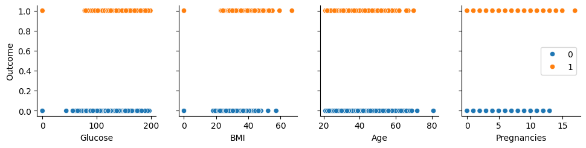
  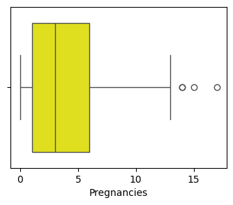
  <br><em>Feature relationships (left) & Outlier detection via boxplots (right)</em>
</p>

---

## Pipeline Architecture

The pipeline is fully automated with **DVC**, ensuring reproducibility and incremental execution.

```
┌─────────────┐     ┌──────────────────┐     ┌───────────────┐
│  Ingestion  │ ──> │ Feature Engineer │ ──> │ Data Splitting│
│ cleaned.csv │     │ engineered.csv   │     │ train/test    │
└─────────────┘     └──────────────────┘     └───────┬───────┘
                                                      │
                                                      ▼
┌─────────────┐     ┌──────────────────┐     ┌───────────────┐
│ Evaluation  │ <── │    Training      │ <── │  SMOTE +      │
│ metrics/plots│    │  5 models + MLflow│    │  Split 80/20  │
└─────────────┘     └──────────────────┘     └───────────────┘
```

### DVC Pipeline Stages

| Stage | Command | Inputs | Outputs |
|-------|---------|--------|---------|
| `ingestion` | `src/ingestion.py` | `data/raw/diabetes.csv` | `data/interim/cleaned.csv` |
| `feature_engineering` | `src/feature_engineering.py` | `data/interim/cleaned.csv` | `data/processed/engineered.csv` |
| `data_splitting` | `src/data_splitting.py` | `data/processed/engineered.csv`, `params.yaml` | Train/test CSVs |
| `training` | `src/train.py` | Train data, `params.yaml` | MLflow runs |
| `evaluation` | `src/evaluate.py` | Test data | `reports/metrics.json`, confusion matrices |

```bash
# Run entire pipeline with a single command
dvc repro
```

DVC automatically skips unchanged stages and only re-executes what's needed when parameters change.

---

## MLflow Experiment Tracking

All experiments are logged under the **`diabetes_clinical_classification`** experiment using a SQLite backend.

```bash
# Launch MLflow UI
mlflow ui
# Opens at: http://127.0.0.1:5000
```

### Screenshots

<p align="center">
  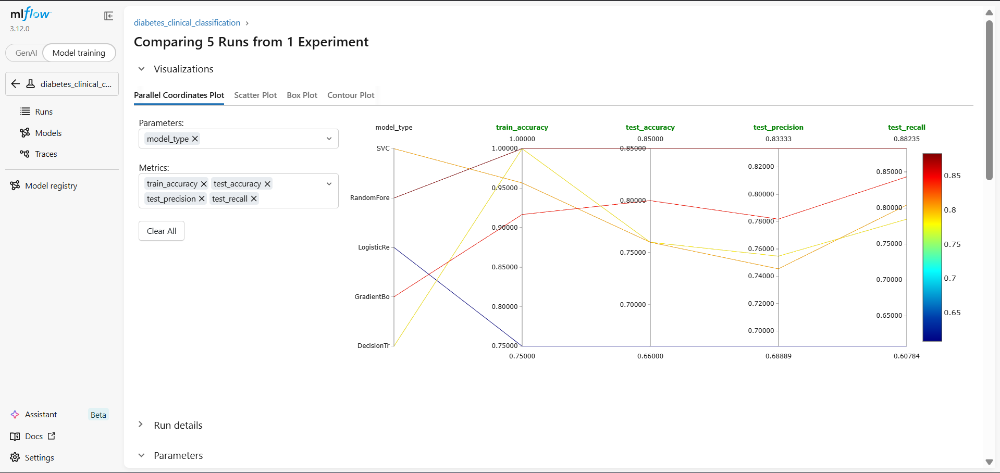
  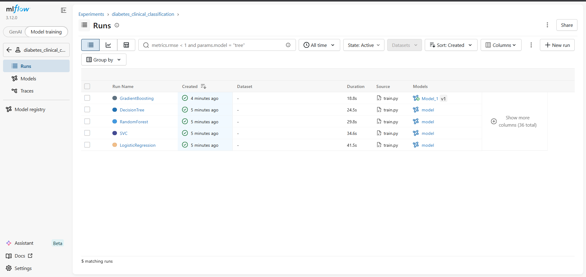
  <br><em>DVC pipeline run (left) & MLflow experiment dashboard (right)</em>
</p>

<p align="center">
  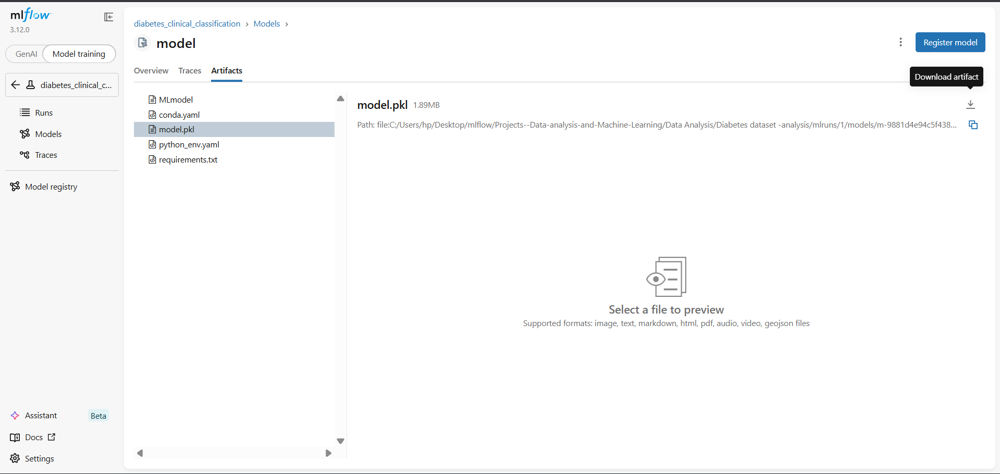
  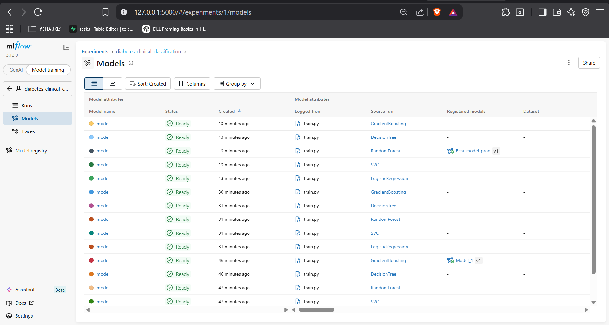
  <br><em>Metrics comparison (left) & Model Registry (right)</em>
</p>

### What's Tracked

| Category | Details |
|----------|---------|
| **Parameters** | `model_type`, `C`, `kernel`, `n_estimators`, `max_depth`, `learning_rate`, etc. |
| **Metrics** | `test_accuracy`, `test_precision`, `test_recall`, `test_f1_score`, `test_auc_roc`, `test_log_loss` |
| **Artifacts** | Confusion matrix plots per model |
| **Models** | Serialized sklearn models registered via MLflow Model Registry |

### Significance of MLflow + DVC

| Tool | Role |
|------|------|
| **MLflow** | Experiment tracking, parameter/metric logging, model registry, artifact storage |
| **DVC** | Data versioning, pipeline automation, caching, change detection |
| **Together** | Full reproducibility — DVC knows *which data + params* produced *which MLflow run* |

---

## Model Performance Comparison

| Model | Accuracy | Precision | Recall | F1-Score | AUC-ROC | Log Loss |
|-------|----------|-----------|--------|----------|---------|----------|
| **RandomForest** 🏆 | **0.8100** | **0.7788** | **0.8713** | **0.8224** | **0.8779** | **0.4374** |
| GradientBoosting | 0.7900 | 0.7611 | 0.8515 | 0.8037 | 0.8370 | 0.4963 |
| DecisionTree | 0.7600 | 0.7524 | 0.7822 | 0.7670 | 0.7598 | 8.6505 |
| LogisticRegression | 0.7550 | 0.7500 | 0.7723 | 0.7610 | 0.8221 | 0.5217 |
| SVC | 0.7550 | 0.7321 | 0.8119 | 0.7700 | 0.0000* | 0.0000* |

> \* SVC lacks `predict_proba` by default, so AUC-ROC and Log Loss are not applicable.

### Confusion Matrices

<p align="center">
  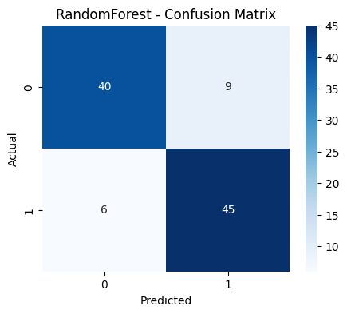
  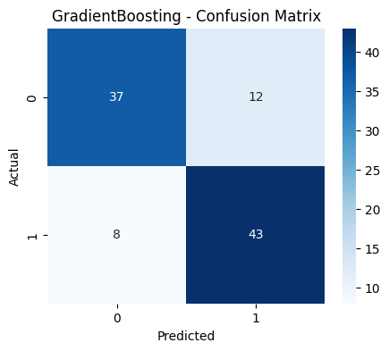
  <br>
  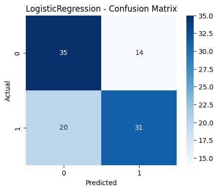
  
  <br><em>Confusion matrices: RF, GB (top) & LR, DT (bottom) — 80/20 split, SMOTE balanced</em>
</p>

### Winner: Random Forest

**RandomForest** selected as production candidate due to best performance across all key metrics, strong generalization (no overfitting vs perfect train score), and robustness to outliers.

---

## Project Structure

```
├── data/
│   ├── raw/                   diabetes.csv (DVC tracked)
│   ├── interim/               cleaned.csv (zeros → NaN)
│   └── processed/             engineered features + train/test splits
├── notebooks/
│   └── eda.ipynb              Complete EDA with all plots preserved
├── src/
│   ├── ingestion.py           Load & clean raw data
│   ├── feature_engineering.py IQR outlier removal, median imputation, scaling
│   ├── data_splitting.py      SMOTE balancing + 80/20 split
│   ├── train.py               Train 5 models with MLflow logging
│   └── evaluate.py            Compute metrics, plot confusion matrices
├── reports/
│   ├── metrics.json            All model metrics
│   ├── cm_RandomForest.png
│   ├── cm_GradientBoosting.png
│   ├── cm_DecisionTree.png
│   ├── cm_LogisticRegression.png
│   └── cm_SVC.png
├── assets/                    Screenshots for README
├── params.yaml                Centralized hyperparameters
├── dvc.yaml                   DVC pipeline definition
├── requirements.txt
├── .gitignore
├── .dvcignore
└── README.md
```

---

## Reproduce the Pipeline

```bash
# 1. Setup
python -m venv venv
.\venv\Scripts\Activate
pip install -r requirements.txt

# 2. Pull data from DVC (if available)
dvc pull

# 3. Run full pipeline
dvc repro

# 4. View MLflow dashboard
mlflow ui

# 5. Compare metrics across runs
dvc metrics diff
```

### Hyperparameter Tuning

Edit `params.yaml` and run `dvc repro` — DVC automatically detects changes and re-executes only affected stages:

```yaml
model_params:
  RandomForest:
    n_estimators: 200    # ← change this
    max_depth: 10        # ← or this
```

---

## Tech Stack

| Category | Tools |
|----------|-------|
| **Data** | Pandas, NumPy |
| **Modeling** | Scikit-Learn |
| **Balancing** | imbalanced-learn (SMOTE) |
| **Experiment Tracking** | MLflow (SQLite backend) |
| **Pipeline/Versioning** | DVC |
| **Visualization** | Matplotlib, Seaborn |
| **Config** | YAML (`params.yaml`) |

---

## License

MIT
